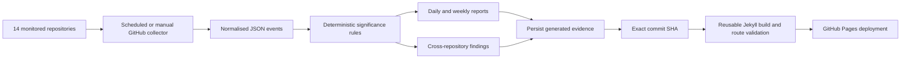

# Architecture

The baseline deliberately avoids a database. Version-controlled JSON and Markdown are sufficient for an auditable early-stage monitor and make changes reviewable through ordinary Git workflows.

Publication is coupled to evidence persistence: the collection workflow passes the exact resulting commit SHA into the reusable Pages workflow. GitHub Pages therefore publishes the same revision that contains the generated portfolio evidence, rather than depending on a secondary workflow being triggered by the bot-authored commit.
