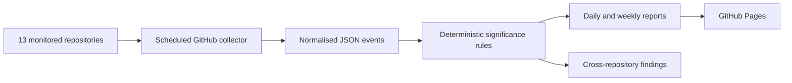

# Architecture

The baseline deliberately avoids a database. Version-controlled JSON and Markdown are sufficient for an auditable early-stage monitor and make changes reviewable through ordinary Git workflows.
