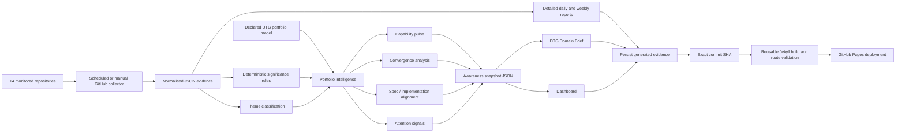

# Architecture

## Architectural principle

The monitor separates **telemetry**, **portfolio intelligence**, and **situational awareness**.

1. GitHub events are preserved as evidence.
2. Deterministic rules classify significance and themes.
3. `config/portfolio-model.yaml` declares how monitored workstreams map to DTG capabilities and relationships.
4. The awareness engine combines those inputs into capability pulse, convergence, alignment, and attention signals.
5. Machine-readable awareness snapshots are persisted before human-facing pages are rendered.

The baseline deliberately avoids a database and does not require an LLM. Version-controlled JSON, YAML, and Markdown remain sufficient for an auditable monitor and keep each interpretation reviewable through ordinary Git workflows.

Publication remains coupled to evidence persistence: the collection workflow passes the exact resulting commit SHA into the reusable Pages workflow. GitHub Pages therefore publishes the same revision that contains the generated portfolio evidence and situational-awareness snapshot.
