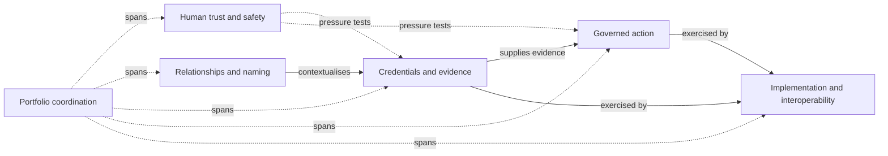

# DTG domain model

The monitor uses `config/portfolio-model.yaml` to translate repository-level telemetry into a portfolio-level view of DTG capability movement.

The model is deliberately **analytical, not normative**. It does not claim to define the official architecture of the Decentralized Trust Graph. It declares how this monitor groups observed work so that its conclusions remain inspectable and reviewable.

## Capability view

## Why a declared model matters

Repository activity alone can answer **what changed**. A declared capability model allows the monitor to ask a second-order question: **which DTG capability moved, and where did related workstreams move together or drift apart?**

The monitor therefore keeps three concepts separate:

1. **Evidence** — observed GitHub events and repository metadata.
2. **Portfolio semantics** — the declared mapping in `portfolio-model.yaml`.
3. **Situational-awareness findings** — deterministic conclusions produced from the first two.

## Pulse vocabulary

Capability pulse is intentionally descriptive rather than evaluative:

- **Advancing strongly** — substantial material activity in the observation window.
- **Advancing** — multiple material changes.
- **Active** — observed activity without enough material change to call the capability advancing.
- **Quiet** — no observed activity in the window.

A quiet capability is not assumed to be unhealthy, blocked, or abandoned. It may be stable, on a different cadence, or active outside the GitHub streams monitored here.

## Cross-capability findings

The awareness layer can surface:

- movement across declared capability relationships;
- specification and implementation alignment;
- specification/implementation asymmetry;
- dependencies where one capability is advancing while a related capability is quiet; and
- recurring themes shared across related capabilities.

Each finding retains the repositories and event URLs that support it. The generated prose is therefore a view over evidence, not a substitute for it.
